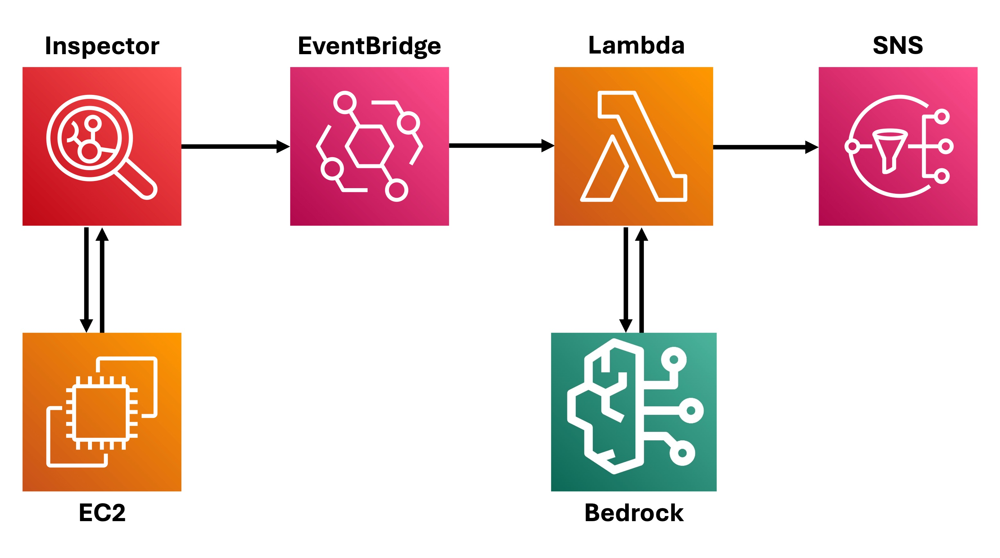

# Leverage AI for Vulnerability Management
## Overview
Securing cloud infrastructure is a never-ending race between security teams and attackers. New vulnerabilities occur every day, and teams need to be able to identify and remediate these vulnerabilities at speed and scale. 

On AWS, Amazon Inspector scans for vulnerabilities, but its remediation recommendations are often vague. AI allows security teams to quickly identify remediation options. This project demonstrates how to leverage LLMs to explain and remediate Inspector vulnerability findings for EC2 instances. 

## Architecture
Inspector continuously scans EC2 instances for new vulnerabilities. A new vulnerability finding triggers a Lambda function via EventBridge. Lambda functions call an LLM via Bedrock. Recommendations from the LLM are incorporated into emails delivered to security teams via SNS. AWS services were provisioned using Terraform (see `terraform/`). Lambda functions were written in Python (see `lambda/`).

