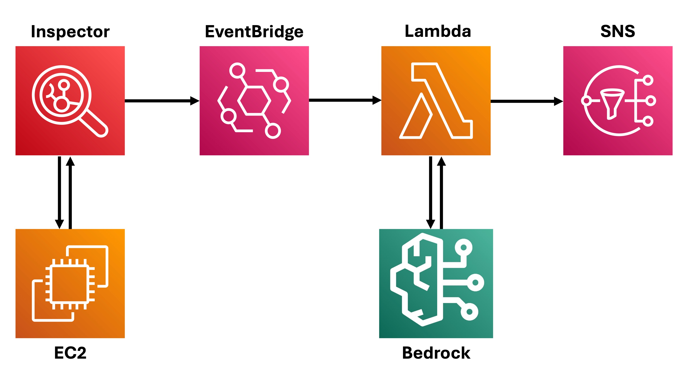

# Leverage AI for Vulnerability Management
## Overview
This project builds an AWS Lambda function to process Amazon Inspector vulnerability findings and deliver AI-generated remediation recommendations via email. Inspector findings are normalized and sanitized against a strict schema to mitigate prompt injection attacks before being passed to a large language model (LLM) via AWS Bedrock. Infrastructure is provisioned with Terraform.

## Architecture
Amazon Inspector continuously scans EC2 instances for new vulnerabilities. A new vulnerability finding triggers a Lambda function ([`src/lambda_function.py`](src/lambda_function.py)) via EventBridge. The Lambda function calls the LLM via Bedrock. Recommendations from the LLM are incorporated into emails delivered to security teams via SNS. AWS services were provisioned using Terraform (see [`terraform/`](terraform/)).

## Prompt Injection Mitigation
Inspector findings contain fields sourced from external vulnerability databases and package metadata. These fields may contain adversarial content designed to manipulate an LLM — a technique known as prompt injection. This project mitigates prompt-injection risk using a layered defense:

1. **Normalization:** Only structured fields with known formats are extracted from findings. Free-text fields such as vulnerability descriptions are discarded. All extracted fields are validated against strict regex patterns before use. If any field fails validation, nothing is passed to the LLM. See `normalize_finding()` in [helpers.py](src/helpers.py), which extracts and validates fields using [field_schema.json](config/field_schema.json).
2. **System Prompt:** Validated fields are passed to the model in the user prompt. The system prompt, which is passed separately, explicitly instructs the model to treat user prompt content as untrusted external input. See `call_bedrock()` in [lambda_function.py](src/lambda_function.py), which passes [system_prompt.txt](config/system_prompt.txt).

## Exposure Assessment
Inspector findings report whether a vulnerability exists in an installed package but do not assess whether it is reachable or exploitable in a specific environment. A vulnerability with a network attack vector, for example, may be unexploitable if the affected service is not exposed. This project passes information about the host and its network via the system prompt and directs the LLM to assess the relevance of the finding based on this information. See [system_prompt.txt](config/system_prompt.txt).